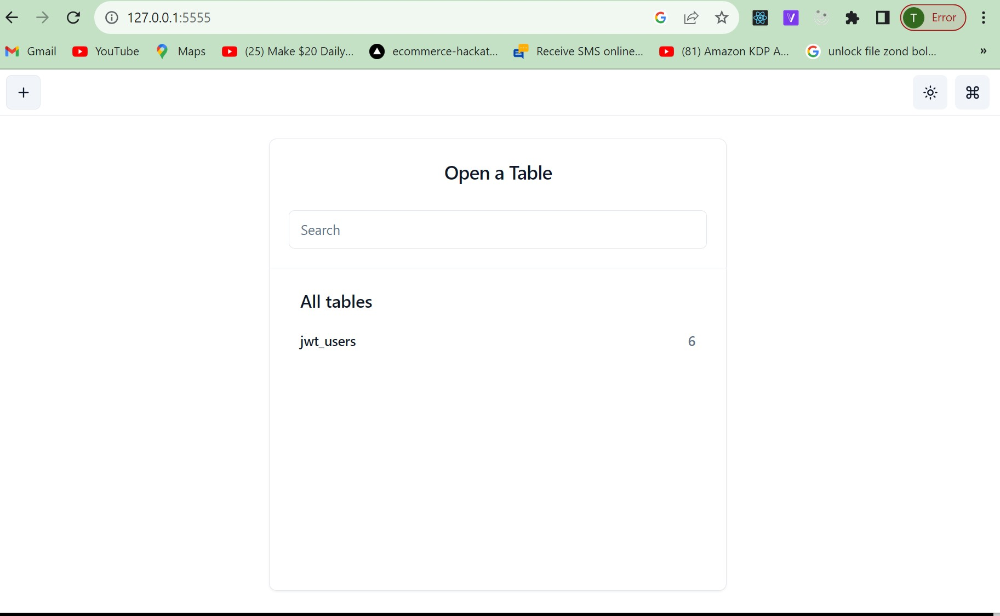
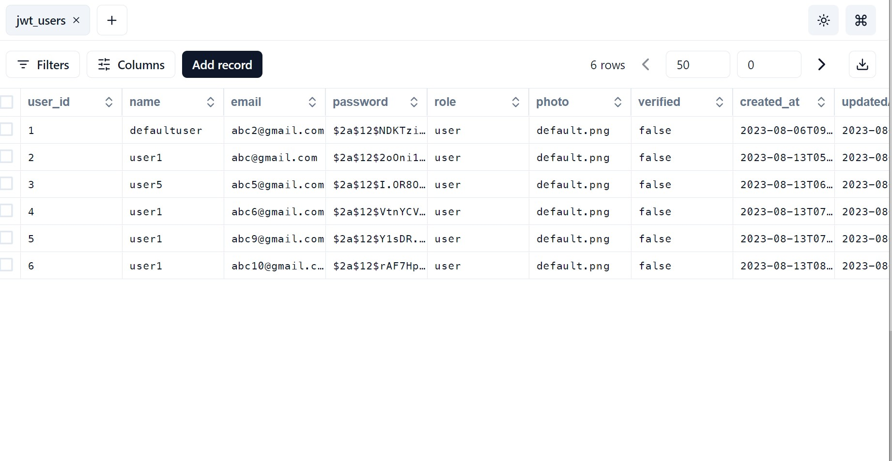

# JWT athentication and middleware protected routes
* [JWT (JSON web token)](https://jwt.io/introduction)
* [JWT debugger](https://jwt.io/#debugger)
* [Middleware protected routes](https://nextjs.org/docs/app/building-your-application/routing/middleware)

# Live site link
  Click on vercel to see it [ vercel](https://jwt-middleware-one.vercel.app/)
## Dummy user
```json
 "email" : "abc@gmail.com"
 "password ": "12345678"
```

## Deploy the project on vercel
1. Sign up or log in at [vercel](https://vercel.com/new)
2. Install vercel cli if already not installed
    ```npm
     npm i -g vercel
    ```
3. From terminal log in to `Vercel``
    ```cmd
      vercel login
    ```
4. Deploy the app
    ```cmd
     vercel
    ```
### Connecting with vercel postgress
5. On vercel dashboard navigate to storage tab and create a new postgres storage. You can also select an already created storage.
6. Connect the deployed project with the selected storage
7. Pull your latest environment variables
    ```cmd
     vercel env pull .env.development.local
    ```
## Installing postgress and drizzle in app
1. Install below dependencies
```npm
   npm i drizzle-orm
   npm i @vercel/postgres
   npm i -D drizzle-kit
```
2. Create `/src/lib/db/drizzle.ts` to define db connection
```ts
   import { sql } from "@vercel/postgres";
   import { drizzle } from "drizzle-orm/vercel-postgres";
   export const db = drizzle(sql);
```
### Create your schema and infer types
3. Create `/src/lib/db/schema/script.ts` or `schema/user , cart , orders etc`. to define tables schema
```ts
import { pgTable, serial, text , varchar, boolean, timestamp } from 'drizzle-orm/pg-core';
import { InferModel } from 'drizzle-orm';

export const jwt_users = pgTable('jwt_users', {
  user_id: serial('user_id').primaryKey(),
  name:varchar("name",{length:256}).notNull(),
  email:varchar("email",{length:256}).notNull().unique(),
  password:varchar("password",{length:256}).notNull(),
  role: text('role', { enum: ['user', 'admin'] }).default("user").notNull(),
  photo:varchar("photo",{length:256}).default("default.png"),
  verified:boolean("verified").default(false),
  created_at: timestamp('created_at').defaultNow(),
  updatedAt: timestamp('updatedAt').defaultNow(),
});

export type User = InferModel<typeof jwt_users> 
export type NewUser = InferModel <typeof jwt_users , "insert" >
```
4. Create `/src/lib/db/dbTypes.ts` to infer types from the defined tables
```ts
    import { InferModel } from 'drizzle-orm';
    import { jwt_users } from './schema/user';
    export type User = InferModel<typeof jwt_users>  // user types
    export type NewUser = InferModel <typeof jwt_users , "insert" > // add new user to db
```
5. Create drizzle configuration file `drizzle.config.ts` at root level
```ts
  import type { Config } from "drizzle-kit";
  import dotenv from "dotenv";
  dotenv.config();
   
  export default {
    schema: "./src/lib/db/schema/*", // it will take all files from schema path
    out: "./drizzle", // output dir. of our schema
  } satisfies Config
```
6. install package
```npm
   npm i dotenv
```
7. Update `package.json` and add following to scripts
```json
"generate": "drizzle-kit generate:pg --schema=./src/lib/db/schema/*",
"drop": "drizzle-kit drop --out=drizzle"
```
8. Update `"target": "es5",` to ` "target": "ES2022"`, in `tsconfig.json`
9. Run command `npm run generate`, this will create `.sql` files for each table in `./drizzle/` folder
```cmd
npm run generate
```
### Setup for running migrations to reflect schema changes on db
10. Create `.env` file with the following content
```.env
POSTGRES_URL="YOUR_POSTGRES_URL"
```
11. Replace content of `drizzle.config.ts` with the following
```javascript
import type { Config } from "drizzle-kit";
import dotenv from "dotenv";
dotenv.config();
export default {
  schema: "./src/lib/db/schema/script.ts",
  out: "./drizzle",
  driver: "pg",
  dbCredentials: {
    connectionString: process.env.POSTGRES_URL + "?sslmode=require" || "",
  },
} satisfies Config;
```
12. Follow one of the next two sections to run migrations
### Run Migrations if storage is connected with single application only

* Follow this section only if new storage is created for this application. In case if you are using any storage with some old data or it is connected to some other application too, running the migration this way will update all the tables in the db based on the schema defined in this application. It will delete or modify all other tables from the db which are not defined in the schema. If you are using a storage with some other applications connected to it skip this section and move to next one.
13. create `/src/lib/db/migrate.ts`
```ts
import { drizzle } from 'drizzle-orm/postgres-js';
import { migrate } from 'drizzle-orm/postgres-js/migrator';
import postgres from 'postgres';
import dotenv from 'dotenv';
dotenv.config();

const DATABASE_URL=process.env.POSTGRES_URL;
const runMigrate = async () => {
	if (!DATABASE_URL) {
		throw new Error('DATABASE_URL is not defined');
	}
    const connectionString = DATABASE_URL+ '?sslmode=require' || ''
    const sql = postgres(connectionString, { max: 1 });
	const db = drizzle(sql);
	console.log('⏳ Running migrations...');

	const start = Date.now();
	await migrate(db, { migrationsFolder: 'drizzle' });

	const end = Date.now();
	console.log(`✅ Migrations completed in ${end - start}ms`);

	process.exit(0);
};

runMigrate().catch((err) => {
	console.error('❌ Migration failed');
	console.error(err);
	process.exit(1);
});
```
14. Update `package.json` and add following to `scripts`
```json
"migrate": "node -r esbuild-register src/lib/db/migrate.ts"
```
15. Add this package
```npm
npm i esbuild-register
npm i postgres
```
16. Run the migrations
```npm
npm run migrate
```
### Run drizzle studio
1. Install following to use drizzle studio
```npm
npm i pg
```
2. Update `package.json` and add following to `scripts`
```json
"drizzle": "drizzle-kit studio --port 5555"
```
3. Run the following to open drizzle studio
```npm 
npm run drizzle
```
4. Drizzle studio can be accessed at the following link
```cmd
http://127.0.0.1:5555/
```
5. Visiting drizzle studio will results in following
    
    

# JWT with middleware

1. create middleware `src/middleware.ts`
